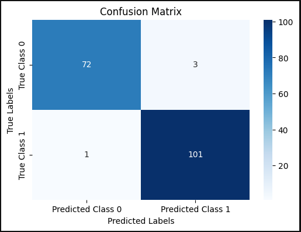
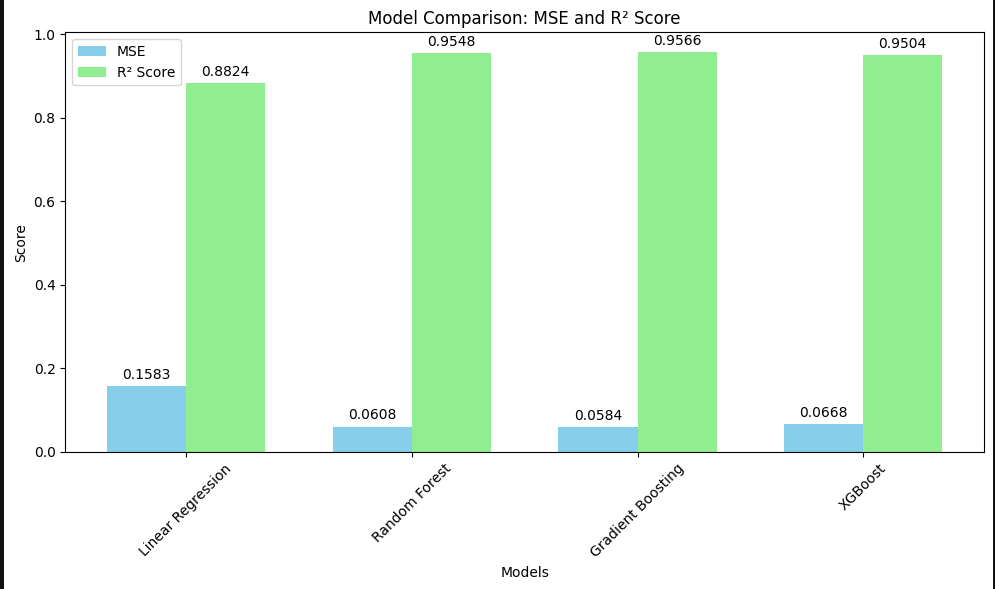
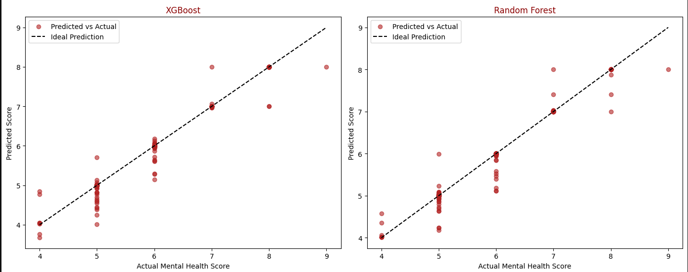
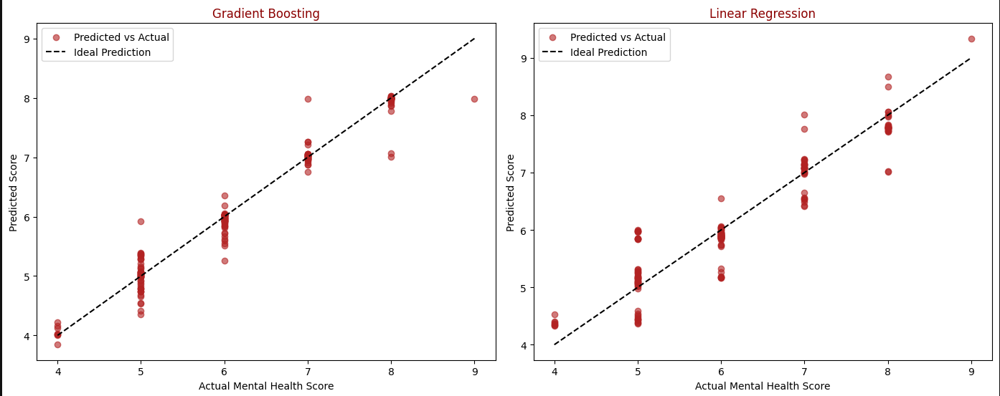

# social-media-addiction :‌ EDA & Modeling

A data science project exploring how **social media usage** relates to **academic performance** and **mental health** among students.  
The notebook walks from **cleaning → EDA → statistical tests → modeling**, with clear visuals and takeaways.

Notebook in Kaggle : 

## Table of Contents
- [Dataset](#dataset)
- [Project Workflow](#project-workflow)
- [Modeling](#modeling)

---

## Dataset
- **Scope:** demographics (Gender, Country, Academic Level, Relationship Status), behaviors (Most Used Platform, Avg_Daily_Usage_Hours, Sleep_Hours_Per_Night, Conflicts_Over_Social_Media), outcomes (Affects_Academic_Performance, Mental_Health_Score, Addicted_Score).
- **Cleaning:** handled missing values, duplicates, outliers; fixed obvious data errors (e.g., country typos).
- **Source:** Provide dataset link here (Kaggle or public URL).

---

## Project Workflow
1. **Data Cleaning:** imputation, de-duplication, outlier checks.
2. **Univariate EDA:** numeric distributions (hist/KDE, boxplots), categorical profiles (counts/percent).
3. **Bivariate EDA:**
   - **Num ↔ Num:** scatter + regression line; **Pearson** & **Spearman**; correlation heatmap.
   - **Num ↔ Cat:** box/violin + jitter; **ANOVA** (η²) & **Kruskal–Wallis**.
   - **Cat ↔ Cat:** contingency, **Chi-square** & **Cramér’s V** (bias-corrected).
4. **Feature Engineering:** encoding, scaling (if needed), splits, and sanity checks.
5. **Modeling:**
   - **Task A (Classification):** Academic performance impact → **Logistic Regression**.
   - **Task B (Regression):** Mental health score → **Linear Regression**, **Random Forest**, **Gradient Boosting**, **XGBoost**.
6. **Evaluation:** Accuracy/F1 & Confusion Matrix (classification); MSE/MAE/R² (regression); model comparison plot.

---

## Modeling

### A) Academic Performance Impact — Classification
- **Model:** Logistic Regression  
- **Why:** interpretable baseline to assess factor associations.
- **Sample Visual:** Confusion Matrix  
  

### B) Mental Health Score — Regression
- **Models:** Linear Regression, Random Forest, Gradient Boosting, XGBoost  
- **Why:** contrast linear vs. ensemble learners for predictive power.
- **Sample Visuals:**

- **MSE & R² Comparison**  
  

    
  

- **Predicted vs. Actual**  
  

    
    
  

---
